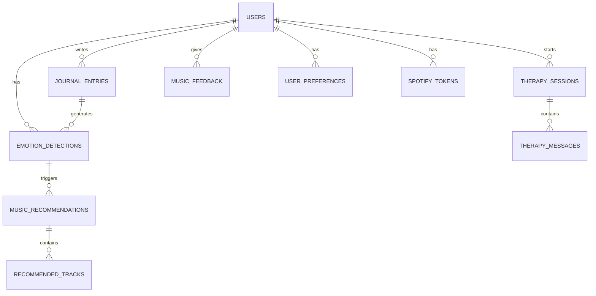

# 🗄️ Database Design — AI Musical Therapy Platform

> **Version**: 0.1.0 | **Last Updated**: July 2026

---

## 1. ER Diagram



---

## 2. Tables

### 2.1 users
| Column | Type | Constraints | Description |
|--------|------|------------|-------------|
| id | UUID | PK, DEFAULT uuid_generate_v4() | Primary key |
| email | VARCHAR(255) | UNIQUE, NOT NULL | User email |
| password_hash | VARCHAR(255) | NULLABLE | Hashed password (null for OAuth-only) |
| full_name | VARCHAR(100) | NOT NULL | Display name |
| avatar_url | TEXT | NULLABLE | Profile picture URL |
| role | ENUM('user','admin','super_admin') | DEFAULT 'user' | User role |
| auth_provider | ENUM('local','google','spotify') | DEFAULT 'local' | Registration method |
| is_active | BOOLEAN | DEFAULT true | Account status |
| email_verified | BOOLEAN | DEFAULT false | Email verification |
| last_login_at | TIMESTAMP | NULLABLE | Last login timestamp |
| created_at | TIMESTAMP | DEFAULT NOW() | Creation timestamp |
| updated_at | TIMESTAMP | DEFAULT NOW() | Last update |
| deleted_at | TIMESTAMP | NULLABLE | Soft delete |

### 2.2 emotion_detections
| Column | Type | Constraints | Description |
|--------|------|------------|-------------|
| id | UUID | PK | Primary key |
| user_id | UUID | FK → users.id, NOT NULL | Detecting user |
| modality | ENUM('face','text','voice','multi') | NOT NULL | Input type |
| primary_emotion | VARCHAR(20) | NOT NULL | Top detected emotion |
| confidence | DECIMAL(5,4) | NOT NULL | Confidence score (0-1) |
| all_emotions | JSONB | NOT NULL | Full emotion distribution |
| source_type | ENUM('upload','webcam','journal','recording') | NOT NULL | Input source |
| source_reference | TEXT | NULLABLE | File path or reference |
| session_id | UUID | NULLABLE | Linked session |
| created_at | TIMESTAMP | DEFAULT NOW() | Detection time |

### 2.3 journal_entries
| Column | Type | Constraints | Description |
|--------|------|------------|-------------|
| id | UUID | PK | Primary key |
| user_id | UUID | FK → users.id, NOT NULL | Author |
| title | VARCHAR(200) | NULLABLE | Optional title |
| content | TEXT | NOT NULL | Journal text |
| word_count | INTEGER | NOT NULL | Word count |
| emotion_detection_id | UUID | FK → emotion_detections.id, NULLABLE | Linked analysis |
| created_at | TIMESTAMP | DEFAULT NOW() | Entry time |
| updated_at | TIMESTAMP | DEFAULT NOW() | Last update |

### 2.4 therapy_sessions
| Column | Type | Constraints | Description |
|--------|------|------------|-------------|
| id | UUID | PK | Primary key |
| user_id | UUID | FK → users.id, NOT NULL | Session user |
| status | ENUM('active','completed','abandoned') | DEFAULT 'active' | Session status |
| initial_emotion | VARCHAR(20) | NULLABLE | Starting emotion |
| final_emotion | VARCHAR(20) | NULLABLE | Ending emotion |
| message_count | INTEGER | DEFAULT 0 | Total messages |
| started_at | TIMESTAMP | DEFAULT NOW() | Session start |
| ended_at | TIMESTAMP | NULLABLE | Session end |

### 2.5 therapy_messages
| Column | Type | Constraints | Description |
|--------|------|------------|-------------|
| id | UUID | PK | Primary key |
| session_id | UUID | FK → therapy_sessions.id, NOT NULL | Parent session |
| role | ENUM('user','assistant','system') | NOT NULL | Message sender |
| content | TEXT | NOT NULL | Message text |
| is_crisis | BOOLEAN | DEFAULT false | Crisis flag |
| created_at | TIMESTAMP | DEFAULT NOW() | Message time |

### 2.6 music_recommendations
| Column | Type | Constraints | Description |
|--------|------|------------|-------------|
| id | UUID | PK | Primary key |
| user_id | UUID | FK → users.id, NOT NULL | Target user |
| emotion_detection_id | UUID | FK → emotion_detections.id, NULLABLE | Triggering detection |
| target_emotion | VARCHAR(20) | NOT NULL | Emotion addressed |
| strategy | VARCHAR(50) | NOT NULL | Therapy strategy used |
| created_at | TIMESTAMP | DEFAULT NOW() | Recommendation time |

### 2.7 recommended_tracks
| Column | Type | Constraints | Description |
|--------|------|------------|-------------|
| id | UUID | PK | Primary key |
| recommendation_id | UUID | FK → music_recommendations.id | Parent recommendation |
| track_name | VARCHAR(300) | NOT NULL | Track title |
| artist_name | VARCHAR(300) | NOT NULL | Artist name |
| spotify_track_id | VARCHAR(50) | NULLABLE | Spotify track URI |
| genre | VARCHAR(50) | NULLABLE | Genre |
| bpm | INTEGER | NULLABLE | Tempo |
| valence | DECIMAL(3,2) | NULLABLE | Musical positivity (0-1) |
| energy | DECIMAL(3,2) | NULLABLE | Energy level (0-1) |
| position | INTEGER | NOT NULL | Order in playlist |

### 2.8 music_feedback
| Column | Type | Constraints | Description |
|--------|------|------------|-------------|
| id | UUID | PK | Primary key |
| user_id | UUID | FK → users.id, NOT NULL | Rating user |
| track_id | VARCHAR(50) | NOT NULL | Track identifier |
| rating | SMALLINT | CHECK (1-5) | User rating |
| emotion_context | VARCHAR(20) | NULLABLE | Emotion when rated |
| created_at | TIMESTAMP | DEFAULT NOW() | Rating time |
| UNIQUE | | (user_id, track_id) | One rating per track |

### 2.9 user_preferences
| Column | Type | Constraints | Description |
|--------|------|------------|-------------|
| id | UUID | PK | Primary key |
| user_id | UUID | FK → users.id, UNIQUE | Owner |
| preferred_genres | JSONB | DEFAULT '[]' | Genre preferences |
| preferred_bpm_range | JSONB | DEFAULT '{}' | BPM range |
| theme | ENUM('light','dark','system') | DEFAULT 'system' | UI theme |
| notifications_enabled | BOOLEAN | DEFAULT true | Notification pref |
| updated_at | TIMESTAMP | DEFAULT NOW() | Last update |

### 2.10 spotify_tokens
| Column | Type | Constraints | Description |
|--------|------|------------|-------------|
| id | UUID | PK | Primary key |
| user_id | UUID | FK → users.id, UNIQUE | Token owner |
| access_token | TEXT | NOT NULL, ENCRYPTED | Spotify access |
| refresh_token | TEXT | NOT NULL, ENCRYPTED | Spotify refresh |
| expires_at | TIMESTAMP | NOT NULL | Token expiry |
| scopes | TEXT | NOT NULL | Granted scopes |
| updated_at | TIMESTAMP | DEFAULT NOW() | Last refresh |

### 2.11 audit_logs
| Column | Type | Constraints | Description |
|--------|------|------------|-------------|
| id | UUID | PK | Primary key |
| user_id | UUID | FK → users.id, NULLABLE | Acting user |
| action | VARCHAR(50) | NOT NULL | Action performed |
| resource_type | VARCHAR(50) | NOT NULL | Affected resource |
| resource_id | UUID | NULLABLE | Resource ID |
| details | JSONB | NULLABLE | Additional context |
| ip_address | INET | NULLABLE | Client IP |
| created_at | TIMESTAMP | DEFAULT NOW() | Action time |

---

## 3. Indexes

```sql
-- Users
CREATE UNIQUE INDEX idx_users_email ON users(email) WHERE deleted_at IS NULL;
CREATE INDEX idx_users_role ON users(role);

-- Emotion Detections
CREATE INDEX idx_emotion_user_date ON emotion_detections(user_id, created_at DESC);
CREATE INDEX idx_emotion_modality ON emotion_detections(modality);

-- Journal
CREATE INDEX idx_journal_user_date ON journal_entries(user_id, created_at DESC);

-- Therapy
CREATE INDEX idx_therapy_user ON therapy_sessions(user_id, started_at DESC);
CREATE INDEX idx_therapy_messages_session ON therapy_messages(session_id, created_at);

-- Music
CREATE INDEX idx_recommendations_user ON music_recommendations(user_id, created_at DESC);
CREATE INDEX idx_feedback_user ON music_feedback(user_id);

-- Audit
CREATE INDEX idx_audit_user ON audit_logs(user_id, created_at DESC);
CREATE INDEX idx_audit_resource ON audit_logs(resource_type, resource_id);
```

---

## 4. Constraints & Normalization

- **3NF (Third Normal Form)** applied to all tables
- **Referential integrity** enforced via foreign keys with ON DELETE CASCADE/SET NULL
- **Check constraints** on ratings (1-5), confidence (0-1), enums
- **Unique constraints** on email, user preferences, feedback (per user+track)
- **Soft deletes** on users table; hard deletes on dependent data after retention period

---

## 5. Future Expansion

| Feature | Tables Needed |
|---------|--------------|
| Group Therapy | `group_sessions`, `group_members` |
| Wearable Data | `biometric_readings` |
| Achievement System | `achievements`, `user_achievements` |
| Content Management | `content_items`, `content_categories` |
| Notifications | `notifications`, `notification_preferences` |

---

> **All database changes must update this document first. Never add tables without PRD and architecture review.**
